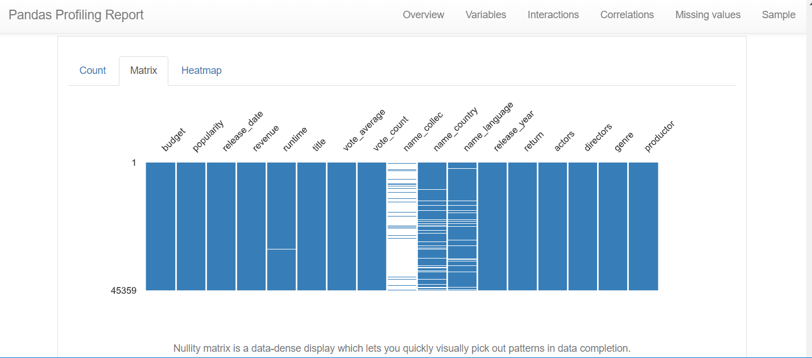
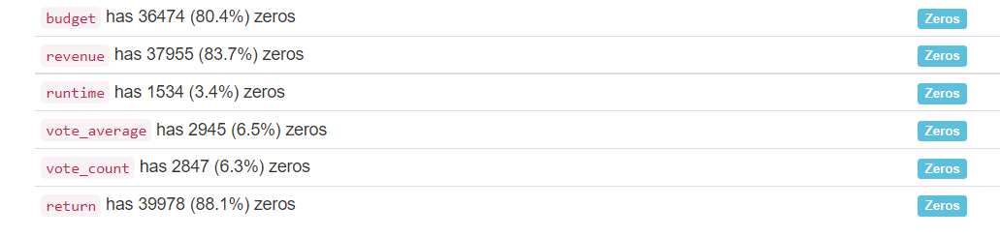
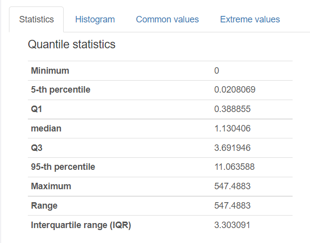
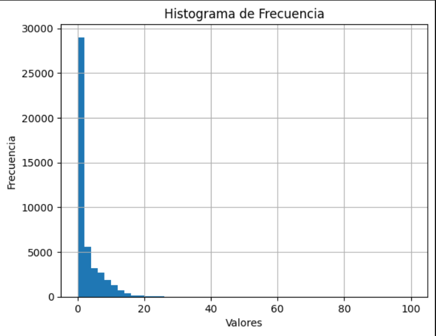
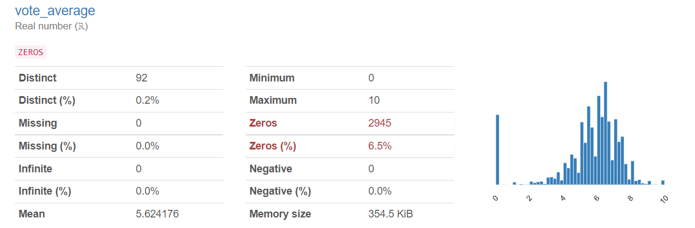
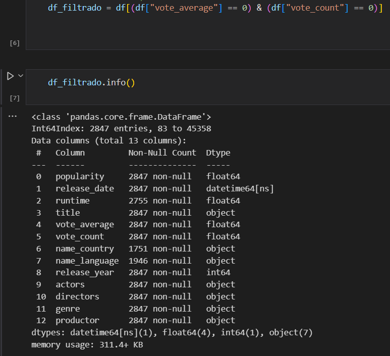
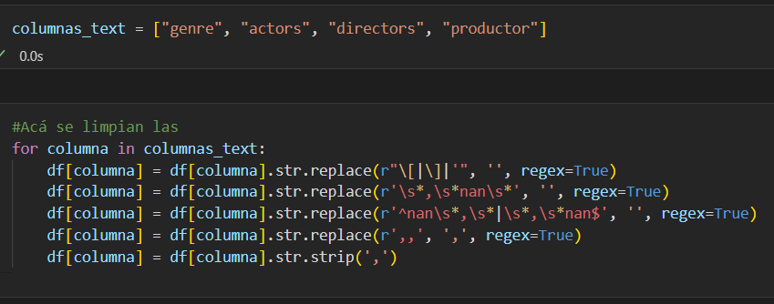
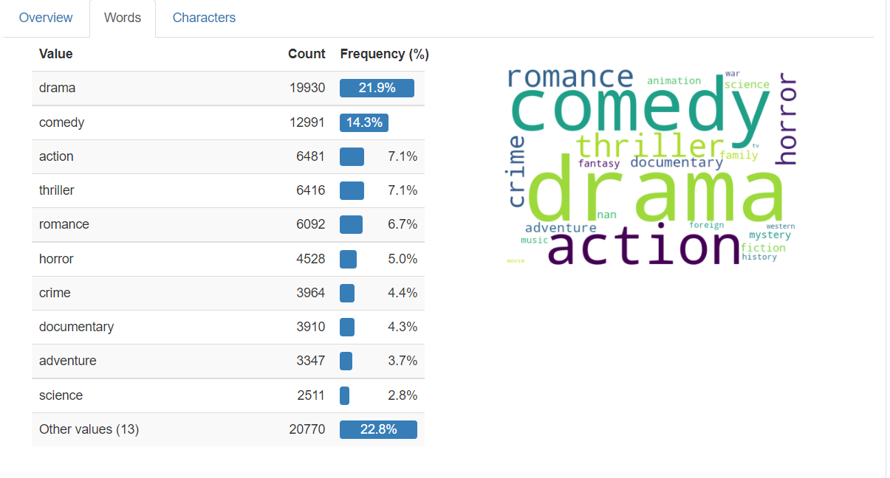

# Proyecto_MLops
Este proyecto tiene como objetivo implementar técnicas de machine learning, implementando un sistema de recomendación de películas, para esto se pasaron por 4 etapas:
1. Entender los requerimientos del proyecto (familiarizarse con los datos)
2. Desarrollar ETL para poder cargar a la API
3. Desarrollar API para la consulta de datos
4. Implementar modelo de machine learning para ser montado en la API
## Revisión de requerimientos
Se analizan los requerimientos del proyecto, las herramientas a utilizar y el posible resultado final.  
Las librerías a utilizar son:
1. Pandas
2. Jason
3. AST
4. Fastapi
5. Unidecode
6. Matplotlib
7. Numpy
8. Sickit-Learn
9. ydata-profiling
## Proceso de extracción, transformación y carga (ETL)
### Extracción:
Para el proceso de extracción se utilizaron los archivos llamados credits.csv y movies_dataset.csv
En primer lugar mediante Python se realizó la carga del archivo movies_dataset.csv y credits.csv en formato DataFrame 
**REVISAR EL ARCHIVO "ETL.ipynb" EN EL SE ENCUENTRA TODO EL PROCESO DE EXTRACCIÓN EXPLICADO**
### Transformación
Una vez cargada la información en Dataframes se procede a limpiar en primer lugar el archivo movies_dataset.csv haciendo las siguientes transformaciones:
- Filtro de valores nulos
- Eliminación de columnas sin importancia
- Cambio a formato fecha a las columnas requeridas
- Desanidar y seleccionar la información relevante pesente en los diccionarios de algunas columnas
- Calculo de columnas como Return y Anio
- Exportar el nuevo datframe limpio
En segundo lugar se procede a limpiar el archivo credits.csv con las siguientes transformaciones:
- Revisión de valores nulos
- Desanidar y seleccionar información relevantes de la columna cast y crew, en este caso solo se necesitan el nombre de los acotres y directores
- Eliminar columnas anidadas
- Exportar el nuevo datframe
Finalmente por medio del Id de cada película se unos los dos Datframes limpios
### Carga
La carga de los datos se realizó mediante la exportación del datframe "final_limpio.csv" y su sincronización con la carpeta Proyecto_MLops en github
**Este proceso se explica de manera más profunda en la creación de la API**
## Desarrollo de la API
Para crear la API se utilizó el framework de Fastapi, se utilizarón los siguientes pasos:
1. Primero se creo un entorno virtual para desarrolar la API
2. Se conecto la carpeta del entorno virtual a este repositorio
3. Se desarrollaron las fucniones que va a tener la API
4. Se creo el archivo main.py que contiene las funciones, y en general el código que permite funcionar la API
### Deployment en Render.com
Finalmente para que la API pueda ser consumida por más personas, se realiza un deployment en la página web de Render, esta lo que permite es la conexión con este
repositorio y su deploy
### **LINK DE ACCESO AL DEPLOYMENT**
https://proyecto-individual-1-ue6k.onrender.com/docs
## Sistema de recomendación
### Pronceso de EDA
En primer cargamos el archivo final_clean.csv para hacer el EDA.
Seguido con la Librería ydata-profiling hacemos el análisis paso por paso:
1. Eliminamos columnas con muchos zeros no importantes y aquellas con muchos valores nulos:  
   **Valores faltantes (entre más blanco más valores faltantes)**
   
   **Valores zero**
   
2. Nos centramos en las columnas que usaremos para el sistema de recomendación, en primer lugar la que tiene nombre "popularity" que se refiere a la popularidad de la película
- El reporte nos menciona que tiene un sesgo muy grande hacia la derecha, es decir, que tiene una cola muy acentuada en este sentido, lo que nos da a entenderque los valores de popularidad se encuentran muchos en un rango pequeño y unos pocos se salen demsiado del rango en sentido positivo  
**Coeficiente de asimetría de "popularity"**  
  
**Percentil 95 se encuentra en 11.0 6**  
  
**Histograma de frecuencias de popularidad**  
  
Con base en la información podemos decir que la mayoría de películas cuentan con una popularidad similar, alreddor del 95% de las películas tienen una popularidad de 11 o menos, sin embargo el otro 5% tiene una popularidad muchísimo mayor, con valores por encima de 20 llegando a 517 como máximo (es probable que el sistema de recomendación se centre en aquellas con valores de 11 o menos)
3. Análisis de la columna "vote_average"
  - El reporte nos muestra que existen muchos votos promedio con un valor de 0 (2945 en total) , lo cual es extraño debido que una película diicilmente consigue una calificación tan baja  
  **Informe e histograma de frecuencia de vote_average**  
      
  - Se observa que hay na columna llamada vote_count, por lo que una posible causa de que hayan películas con puntuación 0 es que no tienen votos, por lo que se procede a verficiar esto  
  **Filtrado de vote_average = 0 por vote_count = 0**  
    
Se observa que 2847 de películas con vote_average 0 se debe a que no tienen ningun voto, por lo que se procede a reemplazar estos valores por el valor promedio de de vote_average 
4. Se limpia la columna genre que hace referencia al género de las películas, esto se lleva a cabo debido a que se encuentra en un formato string simulando una lista  
**Código para limpiar columnas que se encuentran en string tipo lista**  
  
5.  Se realiza el análisis de la columna genre, esto se lleva a cabo una nube de palabras para así poder determinar que género se repite más.
**Nube de palabras del género**
    
  Se observa que los géneros más comúnes en el data set de películas son drama, comedia y acción, por lo que psoblemente el sistema de recomendación se base en estos 3 géneros
### Cosine similarity
**NOTA: ESTE MÉTODO SOLO SE DEJÓ PLANTEADO, DEBIDO A LIMITACONES DE MEMORIA Y DEL SERVIDOR ERA IMPOSIBLE EJECUTARLO EN RENDER, REVISAR ARCHIVO EDA_SIS.ipynb, EN LA PARTE FINAL SE ENCUENTRAN LOS DOS SISTEMAS DE RECOMENDACIÓN**
Para la elaboración de este método se llevaron a cabo los siguientes pasos:
1. Codificación de las variables categóricas, es decir, el título y el género
   - Para la codificación del género se utilizó multilabelbinarizer
   - Para la codificación del título en la librería NLTK, primero se eliminaron los stopword, luego la tokenización, seguido lematización y finalmente la vectorización (El archivo resultante tiene alrededor de 20000 columnas y 45000 filas, su peso es de alrededor de 5gb)
2. Por último se aplica cosine similarity a los valores ya codificados y numéricos del dataframe para obtener la matriz de similitud (Este proceso con mi computador demoró alrededor de 5 horas y la matriz final tiene un peso de 40gb)
   - El funcionamiento se comprobó y si generaba las 5 películas con base en el título, el género, los votos promedios y la popularidad
### KNN (Vecinos más cercanos)
Para este sistema se eliminó la codificación de los títulos debido a el peso del dataframe resultante, y solo se tuvo en cuenta el género, el voto promedio y la popularidad, los pasos para su desarrollo fueron:
1. Usar la códificación del género con multilabelbinarizer
2. Definir el númro de vecinos k = 5
3. Aplicar el modelo a los valores del dataframe
4. crear la función del sistema de recomendación
## EN EL ARCHIVO EDA_SIS.ipnyb PUEDEN ENCONTRAR EN LA PARTE FINAL EL DESARROLLO DE LOS DOS SISTEMAS 

